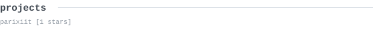

[**discord**](https://discord.com/users/689047015665172569) &nbsp;**·**&nbsp;
[**telegram**](https://telegram.com/@parixiit) &nbsp;**·**&nbsp;
[**twitter**](https://www.x.com/MeParixiit)

<h3>
  
</h3>

> I'm **Parikshit** - student , learner , developer. 
> bringing ideas to life with code and creativity.

<h3>
  
</h3>

  

<h3>
  
</h3>

<!-- PROJECTS LIST START -->
- [**parixiit**](https://github.com/parixiit/parixiit) &nbsp;**·**&nbsp; **★ 2** &nbsp;**·**&nbsp; `Python`  

<!-- PROJECTS LIST END -->

<h3>
  
</h3>

